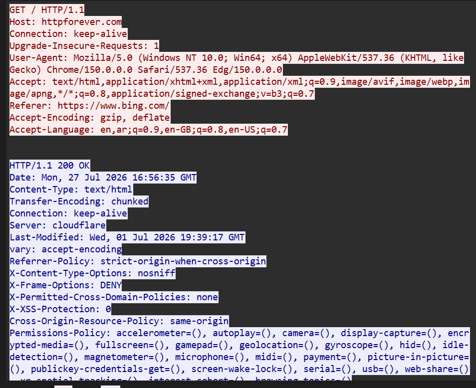

# 📡 Network Traffic Analysis & PCAP Deep-Dive Lab

## 📌 Executive Overview
This repository serves as a hands-on technical portfolio focused on enterprise network traffic inspection, protocol analysis, and threat hunting. Utilizing **Wireshark**, this lab demonstrates the execution of deep packet inspection (DPI), identification of unencrypted credential leaks, and analysis of core network protocol behaviors (TCP, HTTP, DNS).

---

## 🛠️ Lab Setup & Environment
* **Packet Analyzer:** Wireshark v4.x
* **Core Protocols Analyzed:** TCP, HTTP, DNS, ARP
* **Objective:** Verify protocol behavior, detect security anomalies, and document actionable Incident Response (IR) steps.

---

## 🧪 Module 1: Protocol Analysis (TCP 3-Way Handshake)

### Technical Analysis
The TCP 3-way handshake establishes a reliable connection between a client and a target server. The packet sequence observed in Wireshark follows standard RFC 793 parameters:

1. **SYN (Synchronize):** Client initiates session setup with a random initial sequence number ($ISN$).
2. **SYN-ACK (Synchronize-Acknowledge):** Server acknowledges client $ISN$ ($ACK = ISN + 1$) and transmits its own sequence number.
3. **ACK (Acknowledge):** Client confirms server sequence number, establishing an active state (`ESTABLISHED`).

### Key Wireshark Display Filters
```wireshark
# Isolate TCP SYN flags (Handshake initiation)
tcp.flags.syn == 1 && tcp.flags.ack == 0

# Track specific TCP stream session
tcp.stream eq 0
## 🚨 Module 2: Security Threat Analysis (Clear-Text HTTP Credential Leakage)

### Threat Scenario
An internal workstation submitted authentication requests over clear-text HTTP (Port 80), exposing sensitive credentials to local packet capture and potential adversary interception (Man-in-the-Middle).

### Investigation Findings
* **Protocol:** HTTP POST Request
* **Vulnerability:** Lack of Transport Layer Security (TLS/HTTPS Encryption)
* **Risk Impact:** High — Direct disclosure of user credentials across internal networks.

### Packet Proof & Inspection


By following the HTTP TCP stream in Wireshark, plaintext payload data was exposed:
